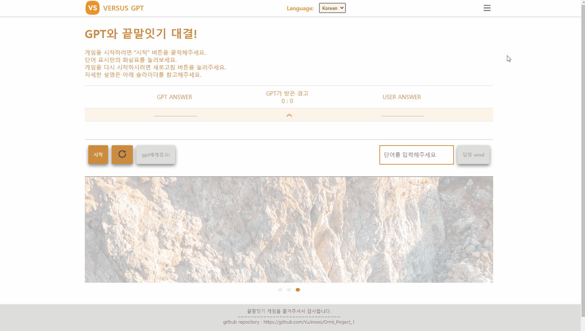

# 프로젝트 : GPT와 끝말잇기 대결

- gpt 3.5 api로 끝말잇기 규칙을 학습시켜서 1:1끝말잇기 놀이를 하는 프로젝트 입니다.
- '시작'버튼을 누르면 gpt가 임의의 단어를 생성해서 보여주면 게임이 시작합니다.

## 목표와 기능

- GPT API를 대화내용으로 학습시켜 끝말잇기 놀이를 이해하고 수행하도록 하고, 유저와 1:1로 끝말잇기 놀이를 진행할 수 있도록 함
- 두 가지 언어(한국어, 영어)로 각각 학습시킨 데이터를 기반으로 끝말잇기 수행
- 단어는 정해진 형태 (JSON의 object) 로 전달 되고, 정해진 형태가 아니라면 경고창을 발생시킵니다.
- PC와 모바일 환경에서도 UI가 동일하게 잘 표현
- HTML, CSS, JavaScript를 사용해서 모듈화하고 토글 메뉴, 단어 보드 숨기기, 배경색 변경 기능을 구현하였습니다.

## 개발 환경 및 배포 URL

1. :computer: 개발 환경

- HTML, CSS, JavaScript
- SweetAlert2, JQuery
- gitHub 페이지 배포

2. :link: 배포 URL

- https://yujinsoo.github.io/Ormi_Project_1/

## GPT와 유저가 단어를 주고받는 방식

- GPT에 단어 전달 형식을 학습시켜서 아래 형식의 **JSON의 object** 형식의 문자열 데이터로 단어를 주고받습니다.
- 전송한 string에서 JSON오브젝트를 파싱하여 단어를 추출합니다.
- 유저가 GPT api에 전송할 때에도 같은 방식으로 전송합니다.

```json
{
  "answer": "단어"
}
```

## 프로젝트 구조

```
│  index.html
│  README.md
│
├─.vscode
│      extensions.json
│
├─asset
│      1.jpg
│      2.jpg
│      3.jpg
│      Circles-menu-3.gif
│      Hourglass.gif
│      menu.svg
│      refresh.png
│      versus.png
│
├─chromedriver_win32
│      chromedriver.exe
│      LICENSE.chromedriver
│
├─css
│      buttonstyle.css
│      headerstyle.css
│      loadingstyle.css
│      mainstyle.css
│      scoreboardstyle.css
│      screenstyle.css
│
├─readme
│      en.gif
│      main.gif
│      menu.gif
│      mobile.gif
│      slider.gif
│
└─src
    │  loading.js
    │  main.js
    │  screen.js
    │  utils.js
    │
    ├─component
    │      answerSection.js
    │      createNode.js
    │      footer.js
    │      header.js
    │      inputSection.js
    │      menuGenerator.js
    │      title.js
    │
    └─dataset
            dataset_en.js
            dataset_ko.js
```

## 개발 일정 (WBS)

- 2023-05-25 ~ 2023-06-14

## 프로젝트 동작 화면

1. 게임 진행 화면

---


---

2. 하단 게임규칙 슬라이더 동작

---


---

3. 상단 토글 메뉴 및 메뉴 기능

---



---

4. 모바일 화면에서도 UI 정상

---


---

5. 영어 데이터셋 적용하여 영어 끝말잇기

---


---

## 개발 이슈

1. 학습을 많이 시켜도 항상 원하는 답을 하지는 않았습니다. 일반적으로 진행 가능한 수준으로 학습시킨 뒤, 예외사항을 처리하거나 추가 기능을 개발하는 것이 효과적이라고 판단했습니다.

2. gpt 스스로 판단해서 JSON오브젝트를 보내지 않는 경우가 있습니다. 이런 case를 처리하는 기능 개발이 추가로 필요합니다. 이런 경우 보여주는 화면에 빈칸 혹은 '-'표시를 하고 게임을 계속 진행할 지 새로운 게임을 시작하게 하는 것이 좋을지 고민중입니다. 현재는 잘못된 api응답으로 처리해 alert을 발생시키고 유저의 판단에 따라 다시 시작하거나 새로 시작하도록 했습니다.

3. gpt가 말하는 단어중 없는 단어가 있습니다. 일단은 유저가 gpt에게 경고 count를 올릴 수 있는 버튼으로 해결하였습니다. 최종적으로 크롤러를 개발해서 사전에서 유효성을 검색하는 기능을 추가하고 싶은데 다른 기능을 모두 완료한 후에 붙이는 식으로 해야 된다고 판단했습니다.

## 추가 개발 계획

- ~~gpt API의 응답 기다리는 동안 로딩 화면 개발~~ 개발완료
- ~~document의 노드를 javascript로 모듈화~~ 개발완료
- ~~영어 모드~~ 개발 완료
- ~~javascript 파일 모듈화~~ 개발완료
- 사전 크롤러 (selenium 사용해보려고 함)
- ~~alert 창 꾸미기~~ 개발완료 > sweetAlert2
- ~~모바일 화면에서 깨지지 않게 해보기~~ 개발 완료
- ~~js 함수에 docstring~~ 달기 완료
- ~~토글 메뉴버튼 추가~~ 완료
- ~~다크모드 기능~~ 완료
- 게임 UI를 게임에 집중할 수 있는 구조로 변경 및 애니메이션 추가 (진행 중)
- 단어 제시 부분 크기를 키우고 같은 위치에 번갈아가면서 표현하고, 누가 말한 단어인지 표기
- 상단 햄버거 메뉴 수정

## :ballot_box_with_check: 느낀 점

- HTML, CSS, JavaScript를 배우고 처음 진행한 프로젝트였기 때문에 진행 속도는 느렸지만, 확실히 진행을 하면서 html, css, JavaScript에 익숙해진 것이 체감되었습니다.

1. 프로젝트 구조

- 처음에 구조를 잘 짜야 나중에 수정할 때 어렵지 않게 수정할 수 있다는 것을 느꼈습니다. 아이디어 자체가 단순했기 때문에 다양한 방법으로 고도화 하고 싶었는데 확장성 있게 짜놓지 않았기 때문인지 개발 속도가 더뎌서인지 쉽게 바꾸기 힘들었습니다.

- 처음에는 index.html 파일에 모든 구조를 작성했었으나, 표현할 구역을 나누어서 vanilla JS 로 Node를 생성하고 추가하는 방식으로 리팩토링 했습니다. 리팩토링 한 후에 코드리뷰에서 게임 내용에 집중이 되지 않는다는 피드백을 받았고, 해결 방안으로 게임 실행창을 상단으로 올리고 집중될 수 있도록 크기를 조정하는 등 구조를 바꿨습니다. 이 때 구조를 나누어서 생성했기 때문에 빠르게 구조를 바꿀 수 있었습니다. 그래서 프로젝트를 계획할 때 기능 혹은 표현되는 범위를 잘 생각하고 범위로 나눠서 개발하는 것이 중요하다는 것을 느꼈습니다.

- 또한 기능을 개발하면서 기능도 중요하지만 임의의 사용자가 보았을 때 어떻게 사용하게 될 지 생각하면서 구성요소를 배치하는 것이 중요하다고 생각했습니다. 코드리뷰를 받을 때 어떤 기능이 중심인지 애매한 UI라는 코멘트를 받았었는데, 내가 개발한 것이 일종의 '게임' 인데 게임 진행에 집중되는 구조가 아니었기 때문에 받은 코멘트라고 생각했습니다. 개발한 사람이 생각했을 때에는 생각한대로 사용자가 사용할 것이라고 생각하지만, 개발하는 사람은 모든것을 자기가 생각해서 개발하기 때문에 유저의 입장을 놓칠 수 있다는 것을 깨닳았습니다. 이러한 점을 유의해서 내가 무엇을 개발하고 있는지, 사용자 입장에서는 어떻게 접근할지 생각해보는게 중요하다고 느꼈습니다. 가장 좋은 방법은 다른 사람에게 사용 피드백을 받는 것이 가장 확실했습니다.

2. 기능

- gpt API에 대화형식으로 학습시키는데, 항상 학습시킨 대로 답을 내리지는 않았습니다. 어느정도 한계가 있는 것으로 알고 있긴 했지만 생각보다 정확도가 더 낮았습니다. 한국어로 학습시키는 것 보다는 영어로 학습시키는 것이 정확하다는 내용을 확인하고 영어로 학습시켜보았습니다. 하지만 영어로 학습시키면 한국어 끝말잇기를 진행할 수 없는 수준이었습니다. 그래서 어느정도 진행 가능한 수준 까지만 진행하고, gpt API의 응답으로 온 문자열을 가공해서 잘 처리하는 것이 최선이었습니다.

- 처음 끝말잇기 게임으로 정했을 때, 크롤링 기능을 넣는 것을 생각했습니다. py-script를 사용해서 beautifulsoup4으로 네이버 사전 사이트를 크롤링하려고 했습니다. 하지만, 정적 크롤링인 bs4로는 크롤링이 불가능한 사이트였습니다. 그래서 일단 다른 방법을 찾아 크롤링 하는 것은 보류하게 되었는데 아직 구현을 하지 못한 것이 가장 아쉬운 부분입니다.

- 크롤링은 파이썬을 실행시킬 방법을 고안해야했지만, 다른 사람들의 프로젝트를 보고 나니 API라는 방법이 있다는 것을 알게 되었습니다. 그래서 `국립국어원 표준국어대사전` API를 사용해서 단어의 유효성을 검사해 GPT가 사전에 없는 단어를 말하더라도 자동으로 점수를 계산할 수 있도록 했습니다.

- `국립국어원 표준국어대사전` open api를 사용할 때 **CORS**에러가 발생했는데 이 문제고 고생을 많이 했습니다. 처음에 `fetch`를 처음 직접 사용하보기 때문에 문법에 확신이 없어서 fetch 문법 오류로 생각하고 구글링했습니다. 하지만 다른 open api(미세먼지, 우리샘, 기초한국어사전, 버스교통량 api 등을 시도했습니다)나 `json placeholder` api를 사용할 때에는 정상적으로 응답을 받았고, api의 응답을 네트워크 탭에서 찍어보면 서버의 응답코드는 200번으로 전송되는데 본문을 읽을 수 없었습니다. 그렇기 때문에 CORS문제가 발생하는 것으로 판단했습니다. 처음에는 `fetch` 문법 중 `mode`로 `no-cors`를 설정하면 해결되는 문제인 줄 알았는데 이렇게 설정한 경우 응답은 받을 수 있지만 그 본문 내용이 매우 제한적으로 전달되었습니다. (응답이 opaque(불투명) 속성으로 설정되어버립니다.)

- 이 **CORS**에러를 해결하기 위해서는 api 서버의 헤더에 내가 사용하는 도메인을 허용하도록 수정하거나 프록시 서버를 사용해야 했습니다. CORS는 브라우저와 서버 간에 제한사항이므로 서버에서 api를 요청하게 되면 이런 제한사항을 무시할 수 있기 때문이었습니다. 서버를 직접 구축하는 것은 배보다 배꼽이 커지는 방법일 것 같았습니다. 그래서 다른 방법을 더 찾아보는 도중, 프록시를 제공해주는 서비스가 있는 것을 발견하여 이 서비스를 이용했습니다. 서비스는 **CORS.SH** 라는 서비스 입니다.(https://cors.sh/)

3. 디자인과 상상력

- 이번 프로젝트를 진행하면서 디자인과 상상력에 대한 생각을 많이 했습니다. 평소에 어떤 사이트를 보더라도 이건 어떻게 만들었을까? 하는 생각을 자주 하지는 않는데, 프로젝트를 진행하면서 위 같은 생각을 하게 되었습니다. 자주 들어가는 사이트의 생김새도 조금 더 자세하게 보게 되어있고, 이건 어떻게 만들었을까 하는 궁금증도 생겼습니다.

- 또한 앞으로 웹사이트를 볼 때 주의깊에 보아야 겠다고 생각했습니다. 막상 프로젝트를 시작하다 보니 어떤 방식으로 어떻게 만들어야 겠다고 생각이 잘 나지 않았습니다. 상상의 나래를 펼쳐서 내가 생각한 것들이 다양하게 나오면 좋겠지만, 보고 경험한 것이 있으면 더욱 좋은 프로젝트를 생각해내고 만들 수 있을 것 같다는 생각이 들었습니다.

## 코드리뷰 받은 항목 및 적용 현황

### 보이는부분

1. ~~왼쪽 로고는 왼쪽으로 좀 더 마진을 주는 것이 좋을 것 같아요.~~ (완료)
2. ~~이미지는 지금 위 아래로 짜부되었습니다.ㅎㅎ 짜부되지 않도록 이미지를 잘라주시던가 width 기준으로만 맞춰지도록 해주세요.~~ (완료)
3. ~~왼쪽 슬라이드, 오른쪽 슬라이드 화살표에 뒤에 백그라운드는 흰색을 빼주시면 좀 더 예쁘게 들어갈 것 같아요.~~ (완료)
4. ~~리프레쉬를 누르면 페이지가 깜빡이는데 깜빡이지 않게 할 수 있을 것 같습니다.~~ (완료)
5. ~~경고 횟수판? 보다는 'GPT가 받은 경고'로 해주는 것이 맞지 않을까요?~~ (완료)

6. ~~단어를 입력해주세요는 왼쪽 여백이 필요해보이고요.~~ (완료)
7. ~~언어 선택도 오른쪽 여백이 좀 더 필요해보이네요.~~ (완료)
8. ~~그리고 GPT ANSWER와 아래 응답되는 텍스트 정렬이 맞지 않습니다.~~ (대략 완료)
9. ~~끝말 잇기이니 마지막 글자에 굵은 글씨를 표현해줘도 좋을 것 같습니다.~~ (완료)
10. ~~footer 아래 흰 줄이 하나 더 있는데 흰줄이 없게 만들어주세요. >> 화면 축소시 생성됨~~ (완료)

### 코드부분

1. ~~문서 내 h1은 필수로 삽입이 됩니다. 서비스 명으로요. 만약 쓰실 생각이 없으시면 section위에 h1을 놓으시고 서비스 명 쓰신다음에 css로 안보이게 넣으시는 것을 권해드립니다.~~ (완료)
2. ~~함수 내부의 변수들은 const로 사용하셔도 됩니다.~~ (완료)
3. ~~console.log로 이곳저곳 많이 찍으셨던데 나중에는 지워주세요. 🙂 주석처리 말고 지워주시는 편이 깔끔합니다. 🙂 어차피 github 히스토리에 남아있으니까요.~~ (완료)
4. ~~외부코드 표기(jquery, sweetalert 사용부분에 라이브러리 사용 여부 주석달아주기)~~ (완료)
5. ~~DOM으로 노드 생성 시 변수명을 좀 더 신경써주시면 좋을 것 같아요.~~ (완료)
6. ~~DOM 노드 생성 함수에 반복되는 코드가 많아 함수로 만들어주면 좋을 것 같아요.~~ (완료)

## 두번째 코드리뷰

### 디자인

1. ~~Header(네비게이션바)와 Footer 부분은 줄이고 메인 컨텐츠 부분의 영역을 더 넓게 잡아주셔야 메인 컨텐츠에 집중할 수 있는 화면을 제공할 수 있습니다.~~ >> header 축소 민 내용 추가하여 적용 (완료)
2. ~~메인의 슬라이드 이미지가 화면이 커질 때 옆으로 부자연스럽게 늘어납니다. (비율이 맞춰지지 않은 채로 늘어남) 이 비율을 유지해주시거나 최대, 최소 크기를 고정해주세요.~~ >> 이미지 잘리는 것으로 크기 고정 (완료)
3. ~~슬라이드에 이 프로젝트에 대한 설명을 넣은 것은 좋지만 전체적인 구성에 있어 메인 컨텐츠가 되는 게임보다 더 강조되는 것 같습니다. 게임 영역을 더 늘려주시거나 슬라이드 부분을 줄여주시는 것이 좋을 것 같습니다. 또한 해당 페이지에 바로 들어갔을 때 어떤 서비스를 제공하는 것인지를 타이틀로 명시해주거나 상단에 제목을 적어주는 식으로 표현해주시는 것이 좋습니다. (언어선택 부분의 강조도 줄이는 것이 좋을 것 같습니다.) ~~ >> 타이틀 추가 및 구성 순서를 변경하여 적용 (완료)

- 끝말잇기 응답이 표시되는 부분이 단순 텍스트로 표현되는 것이 맞을까요?
- ~~슬라이더의 양쪽 화살표가 슬라이더 크기에 비해 작고 눈에 띄지 않아서 사용자가 바로 알기 어려울 것 같습니다. 화살표의 크기를 확대해주시거나 슬라이더의 크기를 줄여주시고 화살표도 배경과 더 구분될 수 있도록 추가 수정하시면 좋을 것 같습니다.~~ >> 화살표 크기 키움 (완료)

### 기능

1. ~~utils.js 에 있는 코드가 제대로 동작하지 않는 것 같습니다. 기능이 어느정도 구현하셨는 지 알 수 없지만 끝말잇기 동작을 제대로 수행할 수 없었습니다.~~ >> dom 을 input으로 가져오게 코딩되어있어서 input을 추가하자 다른 노드를 가져와서 오류가 발생했습니다. id부여하여 수정 (완료)
2. ~~Hourflass.gif를 불러오지 못하고 있습니다. 경로를 다시 살펴봐주세요.~~ (완료)
3. ~~언어선택 기능은 동작하지 않는 것 같습니다.~~ >> 확인해보니 영어로바꾼뒤 다시 한글로 안돌아옴 >> option 내용 수정하면서 오류.. (완료)

### 코드

1. ~~자바스크립트를 가져오는 스크립트 태그는 body 닫기 태그 바로 앞에 위치하는 것이 좋습니다.~~>> 위치이동 (완료)
2. ~~CSS의 반응형 미디어 쿼리의 경우 추가적인 크기 설정을 추가하셔야할 것 같습니다.~~ >> 기준값 수정 및 버튼 배치의 스타일을 변경해서 유연성을 확보하도록 수정했습니다. (완료)
3. ~~utils.js의 api_content 변수를 다시 확인해주세요. answers 변수를 const로 선언하는 것이 맞을까요?~~ >> let변수로 변경(완료)
